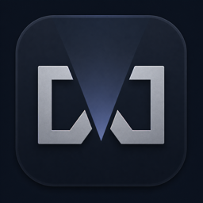

<p align="center">
  
</p>

<h1 align="center">WhereFilm</h1>

<p align="center">
  <strong>Spotlight semántico local para video y foto, nativo de macOS.</strong><br>
  <a href="https://github.com/Ragosorio/wherefilm/releases/latest">Descargar para Mac</a>
  · Apple Silicon · macOS 26
</p>

---

Describe una escena o una frase que alguien dijo, y encuentra el **momento**
exacto — no el archivo. Todo local, sin servidores, sin API, sin costo por
consulta. Y funciona aunque el disco esté desconectado.

> **Si solo quieres usarla:** baja el `.dmg` de la
> [última versión](https://github.com/Ragosorio/wherefilm/releases/latest),
> arrastra WhereFilm a Applications y ábrela. Trae los modelos dentro, así que
> no hay Terminal ni una segunda descarga. La primera vez macOS pedirá una
> aprobación en *Privacidad y seguridad* — está explicado
> [más abajo](#primera-apertura-y-los-99-de-apple).

```
$ wherefilm search "el chavo de playera azul que habló del presupuesto"

Found 3 moments in 112 ms

1. INTERVIEW_JUAN_03.MOV  14:12–14:31   94%
     ✓ visual · "man wearing a blue shirt" · cos 0.241
     ✓ dialogue · 14:16 · "…el problema que tuvimos fue el presupuesto…"
     ⚠ Samsung T7 · offline — Entrevistas/Juan/A0045.mov
```

---

## La idea

**Indexar es caro. Buscar es baratísimo.** Un video de 30 GB se lee **una vez**;
después cada búsqueda solo compara vectores pequeños ya calculados. Por eso este
producto se parece más a *Spotlight + Shazam visual + búsqueda de transcripciones*
que a un chatbot — y por eso cabe en una utilidad de barra de menús.

Cuatro señales independientes, fusionadas al final:

| Señal | Cómo | Responde a |
|---|---|---|
| **Visual** | MobileCLIP en Core ML / Neural Engine → USearch HNSW | qué se veía |
| **Diálogo** | `SpeechAnalyzer` con timestamps → SQLite FTS5 | qué se dijo, y en qué segundo |
| **Texto en pantalla** | Vision OCR sobre los mismos keyframes | letreros, gafetes, claquetas |
| **Metadata** | FTS5 | nombres de archivo, carpetas, cámara |

Lo que hace bueno el resultado no es un modelo gigante entendiendo 30 minutos de
video. Es que *"camisa azul" a las 14:10* y *"presupuesto" a las 14:16* coinciden
en el mismo archivo, con seis segundos de diferencia.

## Lo que no hace

- **No copia ni mueve tus originales.** Cataloga en el lugar donde ya viven.
- **No usa el micrófono.** Lee pistas de audio de archivos en disco.
  `NSMicrophoneUsageDescription` no existe en el `Info.plist`.
- **No manda nada a ningún servidor.** Cero red después de bajar los modelos.
- **No pide Full Disk Access.** Solo las carpetas o discos que elijas.
- **No olvida.** Si borras o mueves un archivo, el índice sobrevive.

---

## Empezar

Requiere macOS 26 (Tahoe) o superior, Apple Silicon, y Xcode 26.

```bash
./Scripts/fetch-models.sh          # MobileCLIP-S0 + tokenizer CLIP (~105 MB)
swift run wherefilm doctor         # verifica todo lo on-device
swift run wherefilm scan ~/Movies --index
swift run wherefilm search "atardecer en la playa"
```

Y la app de barra de menús, o el `.dmg` completo:

```bash
./Scripts/make-app.sh --open       # app en ./build
./Scripts/make-dmg.sh              # .dmg + .zip + SHA256SUMS
```

`make-app.sh` copia los modelos **dentro** del bundle, así que el `.dmg`
funciona en una Mac que nunca vio este repositorio.

Para probar sin tocar tu índice real, `WHEREFILM_HOME` aísla todo:

```bash
swift Scripts/make-test-library.swift /tmp/testlib
WHEREFILM_HOME=/tmp/wfhome swift run wherefilm scan /tmp/testlib --index
```

## El CLI

El CLI no es un extra: ejercita el motor completo sin UI, que es la única forma
válida de medir Core ML y el Neural Engine en hardware real.

| Comando | Qué hace |
|---|---|
| `scan <ruta> [--index]` | cataloga una carpeta o disco en su lugar |
| `index [--full-speed] [--tasks …]` | procesa la cola de trabajos |
| `search <frase> [--explain]` | busca; `--explain` muestra cómo se descompuso |
| `status` | qué sabe el índice, y por qué el indexador está o no trabajando |
| `volumes` | discos conocidos y si están conectados |
| `doctor` | modelos, locales de voz, Apple Intelligence, aceleración SIMD |
| `rebuild-index` | reconstruye el HNSW desde SQLite |
| `tokenize <texto>` | cómo se tokeniza para el text encoder |

---

## Arquitectura

```
Sources/
  WhereFilmCore     esquema · migraciones · identidad de contenido · volúmenes
  WhereFilmML       MobileCLIP Core ML · tokenizer CLIP · índice USearch
  WhereFilmIndex    keyframes · transcripción · OCR · cola · resource governor
  WhereFilmSearch   query planner · canales · fusión temporal · ranking
  WhereFilmCLI      el banco de pruebas
  WhereFilmApp      MenuBarExtra · ventana de búsqueda · reproductor por momento
```

Dos archivos son todo el almacenamiento:

```
~/Library/Application Support/WhereFilm/
    index.sqlite                    la verdad: assets, momentos, transcripciones, vectores
    Vectors/mobileclip-s0-v1.usearch  índice HNSW derivado — se puede borrar y reconstruir
~/Library/Caches/WhereFilm/Previews   miniaturas, con presupuesto y evicción LRU
```

### `asset ≠ location`

La decisión que sostiene el producto. Una ruta nunca es una identidad: las
carpetas se reorganizan, macOS remonta `/Volumes/Media` como `/Volumes/Media 1`,
y el mismo clip vive legítimamente en un SSD, un backup y un NAS a la vez.

```
ASSET   ─ identidad por contenido, transcripción, momentos, embeddings, OCR, previews
   └─ LOCATIONS
        Samsung T7 : Entrevistas/A.mov   ONLINE
        Backup 8TB : 2025/A.mov          OFFLINE   ← el disco está en un cajón
        NAS        : Archive/A.mov       MISSING   ← se borró; el índice permanece
```

`offline` y `missing` son cosas distintas, y ninguna significa *olvidado*.

### Tamaños reales

| | |
|---|---|
| Originales (27.000 × 30 GB) | ~810 TB |
| Vectores en int8 | **~2,5 GB** |
| Miniatura por momento, si no hubiera presupuesto | ~97 GB ← el riesgo real |

Por eso los previews son una cache con techo, y los vectores se guardan
cuantizados con su `modelID` — cambiar de modelo es un reindexado en segundo
plano, nunca una migración destructiva.

---

## Convivir con DaVinci Resolve

Honestidad primero: **ningún análisis de IA es gratis.** Lo que sí se puede es
que el indexador tenga prioridad mínima y se quite de en medio.

- Core ML fijado a `.cpuAndNeuralEngine` — evita deliberadamente la GPU que el
  editor está castigando.
- Workers desechables: el modelo se carga, procesa un lote, y se libera.
- El governor se consulta **antes de cada trabajo**: estado térmico, Low Power
  Mode, batería, y si Resolve/Premiere/FCP están al frente.
- `Pause · 2h` en la barra de menús es real, y se reactiva solo.

---

## Primera apertura, y los $99 de Apple

Esta edición está firmada *ad-hoc*, no con un Developer ID de pago, y no está
notarizada. La consecuencia está **medida, no supuesta**: se le pone al `.dmg`
la misma marca de cuarentena que pone un navegador y se le pregunta al sistema.

```
$ xattr -w com.apple.quarantine "0083;…;Safari;" WhereFilm.dmg
$ spctl -a -vvv WhereFilm.app
WhereFilm.app: rejected
```

Así que en otra Mac la primera apertura necesita una aprobación manual:
**Configuración del Sistema › Privacidad y seguridad › Abrir de todas formas.**
Una sola vez, y macOS lo recuerda.

No hay sustituto gratuito de Developer ID + notarización, y aquí no se intenta
desactivar ni evadir Gatekeeper: la app simplemente se aprueba una vez, por la
persona dueña de la Mac. Con una licencia de Apple, `make-dmg.sh` solo necesita
cambiar la identidad de firma y añadir `notarytool`.

## Estado

Funciona de punta a punta, verificado en un MacBook Air M4 con material real:
búsqueda visual en inglés y español, transcripción en español con timestamps,
OCR, detección de archivos movidos y borrados, previews offline. 45 pruebas
pasando.

El `.dmg` se verifica simulando una Mac limpia — sin modelos instalados y con un
índice vacío — y dejando que la app haga todo el recorrido sola:

```bash
WHEREFILM_HOME=/tmp/fresh \
WHEREFILM_QA_LIBRARY=/tmp/testlib \
WHEREFILM_DEMO_QUERY="playa con olas" \
WHEREFILM_QA_REPORT=1 \
  build/WhereFilm.app/Contents/MacOS/WhereFilm
```

La app se autorretrata y se autoinspecciona desde su propio proceso
([`Snapshot.swift`](Sources/WhereFilmApp/Snapshot.swift)): reporta la geometría
de la ventana, los resultados y sus previews, y sale con código 1 si algo falla.
Deliberadamente no usa captura de pantalla ni las APIs de accesibilidad — una
captura fotografía lo que haya en el monitor, que es una superficie de privacidad
que una herramienta de búsqueda no tiene por qué abrir.

Lo que sigue está en [`docs/PLAN.md`](docs/PLAN.md) §9 — sobre todo medir recall
español contra inglés en un archivo real antes de decidir si vale la pena subir
a SigLIP 2, y el indexado incremental con FSEvents.

## Documentación

- [`docs/PLAN.md`](docs/PLAN.md) — el plan completo: decisiones, fases, riesgos, costos
- [`docs/decisions/`](docs/decisions/) — seis ADRs con el porqué de cada elección
- [`docs/RESEARCH-NOTES.md`](docs/RESEARCH-NOTES.md) — de dónde salió todo esto

## Licencia y créditos

Código bajo MIT. Los modelos **no** se distribuyen con el repositorio:
`Scripts/fetch-models.sh` baja MobileCLIP de `apple/coreml-mobileclip`
(licencia Apple ASCL) y el vocabulario CLIP de `openai/clip-vit-base-patch32`.

Referencias que valieron la pena estudiar: Peakto (búsqueda conversacional con
discos desconectados), Adobe Media Intelligence (análisis local cacheable),
Axle AI e Iconik (*catalog in place*), `openara-ai/media-search-agent`,
`chn-lee-yumi/MaterialSearch`, Fennec Search, CLIP-Finder2, PrivateLens.
